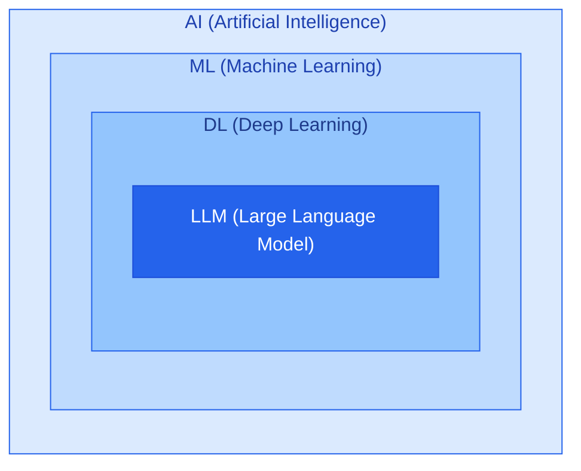

 

# Day 1. Spring AI 시작하기

 

## 1. AI와 LLM

 

### · AI, ML, DL의 관계

AI(Artificial Intelligence)는 인간의 지능적인 작업을 컴퓨터가 수행하도록 만드는 기술을 의미한다.

```mermaid
flowchart TB
    subgraph AI["AI (Artificial Intelligence)"]
        direction TB

        subgraph ML["ML (Machine Learning)"]
            direction TB

            subgraph DL["DL (Deep Learning)"]
                direction TB

                LLM["LLM (Large Language Model)"]
            end
        end
    end

    style AI fill:#DBEAFE,stroke:#2563EB,color:#1E40AF
    style ML fill:#BFDBFE,stroke:#2563EB,color:#1E40AF
    style DL fill:#93C5FD,stroke:#2563EB,color:#1E3A8A
    style LLM fill:#2563EB,stroke:#1D4ED8,color:#FFFFFF
```
