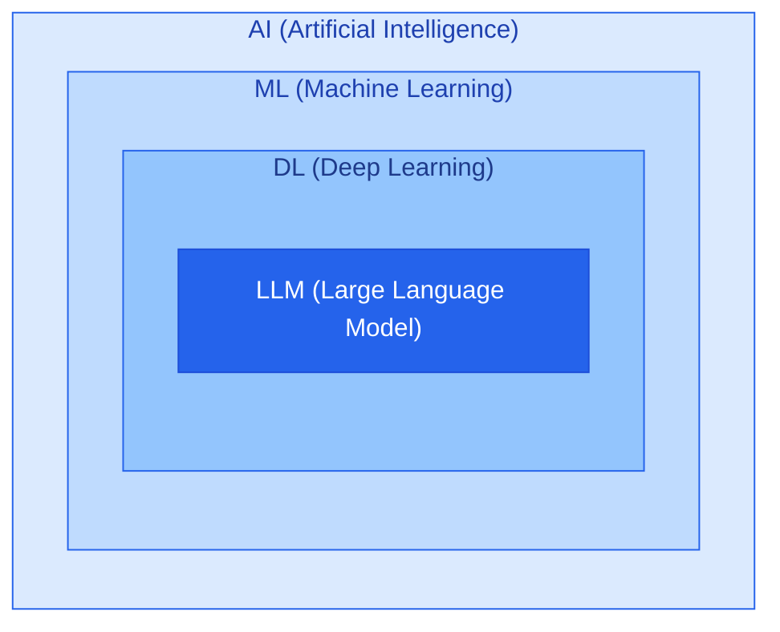

<br>

# Day 1. Spring AI 시작하기

<br>

## 1. AI와 LLM

<br>

### · AI, ML, DL의 관계

AI(Artificial Intelligence)는 인간의 지능적인 작업을 컴퓨터가 수행하도록 만드는 기술을 의미한다.




```aiignore
AI (인공지능) : 인간의 지능적인 작업을 수행하는 기술 전반

ML (머신러닝) : 데이터를 학습하여 패턴을 찾는 기술

DL (딥러닝) : 다층 신경망을 활용하는 머신러닝 기술

LLM (거대 언어 모델) : 대규모 데이터로 학습한 언어 모델
```

<table>
    <thead>
        <th>학습 방식</th>
        <th>설명</th>
    </thead>
    <tbody>
        <tr>
            <td>지도 학습</td>
            <td>정답이 있는 데이터로 학습</td>
        </tr>
        <tr>
            <td>비지도 학습</td>
            <td>정답 없이 데이터의 패턴을 학습</td>
        </tr>
        <tr>
            <td>강화 학습</td>
            <td>행동에 따른 보상을 통해 학습</td>
        </tr>
    </tbody>
</table>

<br>

### · LLM (Large Language Model)

LLM은 대규모 텍스트 데이터를 학습하여 자연어를 이해하고 생성하는 모델이다.

대표적으로 Transformer 아키텍처를 기반으로 하며, 입력된 문맥에서 다음에 등장할 토큰을 예측하는 방식으로 동작한다.

LLM을 활용하는 주요 방법은 다음과 같다.

<table>
    <thead>
        <th>방법</th>
        <th>설명</th>
    </thead>
    <tbody>
        <tr>
            <td>Pre-training</td>
            <td>대규모 데이터로 모델을 사전 학습</td>
        </tr>
        <tr>
            <td>Fine-tuning</td>
            <td>특정 목적에 맞게 모델을 추가 학습</td>
        </tr>
        <tr>
            <td>Prompt Engineering</td>
            <td>입력 프롬프트를 설계하여 원하는 응답 유도</td>
        </tr>
    </tbody>
</table>

Spring AI에서는 일반적으로 이미 학습된 모델 API를 호출하기 때문에, 직접 모델을 학습시키지 않고도 AI를 구현할 수 있다.

<br>
<hr>

## 2. LLM의 작동 원리

<br>

LLM은 사용자의 질문을 받아 한 번에 완성된 답변을 출력하는 것이 아니라, 토큰 단위로 다음 내용을 예측한다.

```aiignore
1. 질의문 입력 : 사용자가 자연어로 질문을 전달한다.

                        ↓
                    
2. 토큰화 (Tokenization) : 입력된 문장을 모델이 처리할 수 있는 토큰 단위로 분리한다.

                        ↓

3. 임베딩 (Embedding) : 토큰을 모델이 처리할 수 있는 벡터 표현으로 변환한다.

                        ↓
    
4. Transformer 처리 : Self-Attention 등을 이용하여 문맥과 토큰 간 관계를 처리한다.

                        ↓

5. 다음 토큰 예측 : 다음에 등장할 토큰의 확률을 계산하고 토큰을 선택한다.

                        ↓

6. 응답 생성 : 생성과 선택을 반복하여 최종 응답을 완성한다.
```

<br>

### · Token과 Embedding의 차이

두 개념은 서로 연결되어 있지만 역할이 다르다.

- Token : 모델이 문장을 처리하는 기본 단위
- Embedding : 토큰이나 문장 등을 숫자 벡터로 표현한 것

특히 임베딩은 이후 RAG를 학습할 때 중요한 개념이다.

예를 들어 문서와 질문을 임베딩하여 벡터로 표현하면, 두 벡터 사이의 유사도를 계산하여 의미적으로 가까운 문서를 검색할 수 있다.

단, RAG의 문서 검색에 사용하는 임베딩 모델과 LLM 내부의 토큰 임베딩 역할은 다르다.

<br>
<hr>

## 3. 토큰과 API 비용

<br>

LLM API는 일반적으로 입력 토큰과 출력 토큰의 사용량을 기준으로 비용을 산정한다.

따라서 불필요하게 긴 프롬프트나 응답은 비용 증가로 이어질 수 있다.

<br>

### · 토큰 절약 전략

<table>
    <thead>
        <th>방법</th>
        <th>설명</th>
    </thead>
    <tbody>
        <tr>
            <td>질문 간결화</td>
            <td>불필요한 문장 제거</td>
        </tr>
        <tr>
            <td>출력 형식 지정</td>
            <td>필요한 형태로만 응답 요청</td>
        </tr>
        <tr>
            <td>최대 출력 토큰 설정</td>
            <td>생성되는 응답 길이에 상한 설정</td>
        </tr>
        <tr>
            <td>System Prompt 활용</td>
            <td>반복되는 역할과 규칙을 관리</td>
        </tr>
    </tbody>
</table>

<br>

예를 들어 다음과 같이 출력 조건을 구체적으로 지정할 수 있다.

> Spring AI의 특징을 3가지 항목으로 요약해 줘.
> 각 항목은 1문장으로 작성해 줘.

다만 정확성을 위해 필요한 정보까지 무조건 줄이는 것은 피해야 한다.


<br>
<hr>

## 4. Spring AI란?

<br>

Spring AI는 Spring 애플리케이션에서 AI 모델을 쉽게 연동하도록 지원하는 프레임워크이다.

다양한 AI 모델에 대한 공통 추상화를 제공하므로, 개발자는 모델별 HTTP 요청을 직접 구현하지 않고도 AI 기능을 사용할 수 있다.

<br>

### · 주요 특징

<table>
    <thead>
        <th>특징</th>
        <th>설명</th>
    </thead>
    <tbody>
        <tr>
            <td>Model Abstraction</td>
            <td>AI 모델을 공통 인터페이스로 사용</td>
        </tr>
        <tr>
            <td>Spring 통합</td>
            <td>DI, Bean, 설정 파일 활용</td>
        </tr>
        <tr>
            <td>ChatClient</td>
            <td>AI 모델과의 대화 요청 처리</td>
        </tr>
        <tr>
            <td>Vector Store</td>
            <td>임베딩 벡터 저장 및 검색</td>
        </tr>
        <tr>
            <td>RAG 지원</td>
            <td>외부 문서를 검색하여 답변 생성</td>
        </tr>
    </tbody>
</table>

<br>

### · Spring AI의 기본 구조

```aiignore
Client (사용자 요청) → Spring Boot 애플리케이션 (Controller → Service → ChatClient)

→ LLM API (Gemini, OpenAI 등) → AI 응답 반환
```

<br>

### · RAG를 적용하면?

RAG(Retrieval-Augmented Generation)는 외부 문서를 검색하여 LLM의 답변 생성에 활용하는 기술이다.

일반적인 AI 서비스는 모델에 질문을 전달하지만, RAG는 질문과 관련된 문서를 검색하고 해당 문맥을 함께 전달한다.

```aiignore
[문서 등록]
문서 → 임베딩 → Vector Store 저장

[사용자 질문]
질문 → 관련 문서 검색 → 검색 결과 + 질문
                          ↓
                      Chat Client
                          ↓
                         LLM
                          ↓
                       답변 생성
```

<br>
<hr>

## 5. ChatClient

<br>

`ChatClient`는 Spring AI에서 AI 모델과의 대화를 처리하기 위한 API이다.

HTTP 요청이나 응답 구조를 직접 작성하지 않고, 메서드 체이닝 방식으로 프롬프트를 구성하고 모델을 호출할 수 있다.

<br>

### · 기본 사용법

```java
String answer = chatClient.prompt()
        .user("Spring AI가 무엇인가요?")
        .call()
        .content();
```

<table>
    <thead>
        <th>메서드</th>
        <th>역할</th>
    </thead>
    <tbody>
        <tr>
            <td>prompt()</td>
            <td>새로운 프롬프트 생성</td>
        </tr>
        <tr>
            <td>system()</td>
            <td>AI의 역할과 공통 지침 지정</td>
        </tr>
        <tr>
            <td>user()</td>
            <td>사용자의 질문 설정</td>
        </tr>
        <tr>
            <td>call()</td>
            <td>모델 호출 및 응답 획득</td>
        </tr>
        <tr>
            <td>content()</td>
            <td>응답의 텍스트 추출</td>
        </tr>
    </tbody>
</table>

<br>
<hr>

## 6. System Message와 Prompt Template

<br>

### · System Message

AI의 역할과 응답 규칙을 설정하는 메시지이다.

```java
.system("""
        당신은 전문적인 독서 도우미입니다.
        답변은 한국어로 작성하세요.
        """)
```

<br>

### · Prompt Template 

동적으로 변경되는 값을 프롬프트에 전달할 때 사용한다.

```java
.user(u -> u.text("""
        도서명: {title}
        요청사항: {question}
        """)
        .param("title", title)
        .param("question", question))
```

<br>

<table>
    <thead>
        <th>구분</th>
        <th>System Message</th>
        <th>Prompt Template</th>
    </thead>
    <tbody>
        <tr>
            <td>목적</td>
            <td>AI 역할과 지침 설정</td>
            <td>동적 입력값 전달</td>
        </tr>
        <tr>
            <td>내용</td>
            <td>서비스 공통 규칙</td>
            <td>사용자의 실제 요청</td>
        </tr>
        <tr>
            <td>예시</td>
            <td>전문 번역가 역할</td>
            <td>번역할 문장, 대상 언어</td>
        </tr>
    </tbody>
</table>

<br>
<hr>

## 7. Structured Output

<br>

일반적으로 LLM의 응답은 문자열이다.

하지만 실제로 백엔드 서비스에서는 DTO와 같은 구조화된 데이터가 필요한 경우가 많다.

이때 Structured Output을 활용하면 응답을 특정 자료형으로 변환할 수 있다.

```java
record BookSummary(
        String title,
        String summary
) {}

BookSummary response = chatClient.prompt()
        .user("어린 왕자를 요약해 주세요.")
        .call()
        .entity(BookSummary.class);
```

.content()가 문자열을 반환하는 데 사용된다면, .entity()는 응답을 지정한 객체 형태로 변환하는 데 사용된다.

단, LLM이 항상 올바른 형식으로 응답한다는 보장은 없으므로 응답 변환 오류에 대한 예외 처리가 필요하다.

<br>
<hr>

## 8. 백엔드에서 AI API를 관리해야 하는 이유

<br>

클라이언트에서 LLM API를 직접 호출하기보다는 백엔드에서 호출하도록 구성하는 것이 일반적이다.

주요 이유는 다음과 같다.

1. API Key를 클라이언트에 노출하지 않기 위해서
2. 사용자 인증 및 호출 권한을 관리하기 위해서
3. 요청 횟수와 비용을 관리하기 위해서
4. 프롬프트와 비즈니스 로직을 통합하기 위해서
5. 외부 API 오류를 일관된 응답으로 변환하기 위해서

특히 API Key는 소스 코드에 직접 작성하지 않고 환경 변수로 관리해야 한다.

<br>
<hr>

<br>

이번 학습의 핵심은 AI 모델을 직접 개발하는 것이 아니라, 기존 Spring Boot 애플리케이션에서 AI 모델을 안전하게 호출하고 응답을 서비스 형태로 제공하는 방법을 이해하는 것이다.

<br>